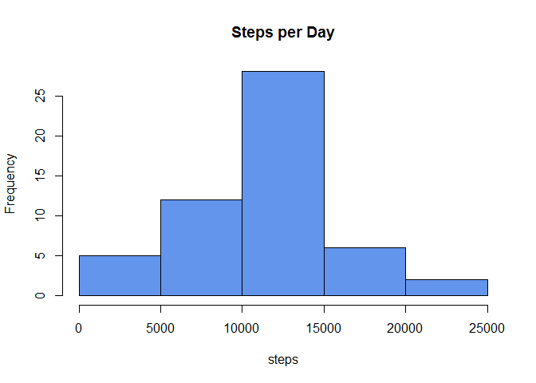
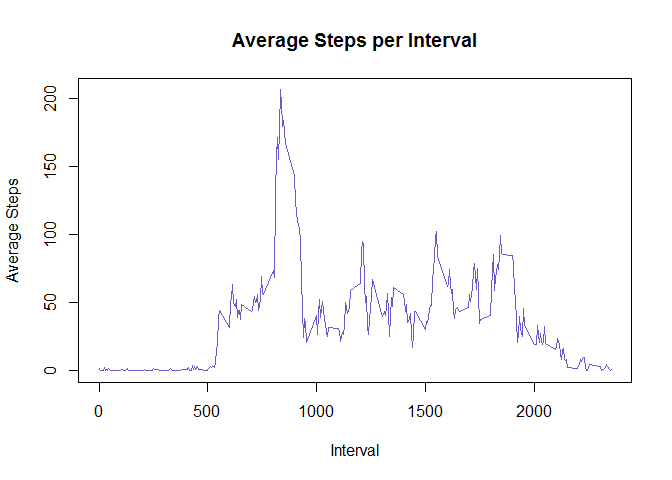
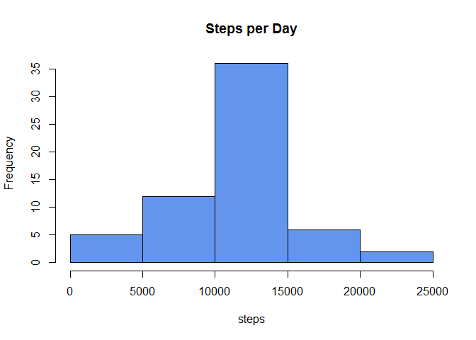
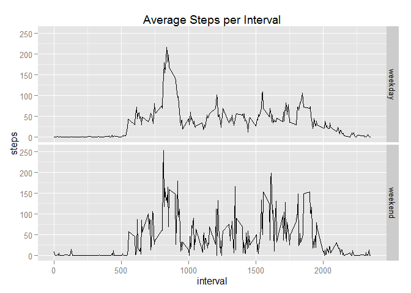

# Reproducible Research: Peer Assessment 1


```
## Warning: package 'knitr' was built under R version 3.1.3
```

### Introduction

It is now possible to collect a large amount of data about personal movement using activity monitoring devices such as a Fitbit, Nike Fuelband, or Jawbone Up. These type of devices are part of the “quantified self” movement – a group of enthusiasts who take measurements about themselves regularly to improve their health, to find patterns in their behavior, or because they are tech geeks. But these data remain under-utilized both because the raw data are hard to obtain and there is a lack of statistical methods and software for processing and interpreting the data.

This assignment makes use of data from a personal activity monitoring device. This device collects data at 5 minute intervals through out the day. The data consists of two months of data from an anonymous individual collected during the months of October and November, 2012 and include the number of steps taken in 5 minute intervals each day.

#### Loading and preprocessing the data
The data for this assignment was downloaded from the course website:

Dataset: [Activity monitoring data]("https://d396qusza40orc.cloudfront.net/repdata%2Fdata%2Factivity.zip")


```r
activity = read.csv("activity.csv")
```

#### What is mean total number of steps taken per day?
For this part of the assignment, you can ignore the missing values in the dataset.

1. Calculate the total number of steps taken per day
    
    ```r
    stepsPerDay = aggregate(steps ~ date, activity, sum)
    ```
1. Make a histogram of the total number of steps taken each day
    
    ```r
     hist(stepsPerDay$steps, main="Steps per Day", col="cornflowerblue", xlab="steps")
    ```
    
     
1. Calculate and report the mean and median of the total number of steps taken per day
    
    ```r
    mean_steps=mean(stepsPerDay$steps)
    median_steps=median(stepsPerDay$steps)
    ```
    - The mean number of steps per day was: 10,766.19.
    - The median number of steps per day was: 10,765.

#### What is the average daily activity pattern?
1. Make a time series plot (i.e. type = "l") of the 5-minute interval (x-axis) and the average number of steps taken, averaged across all days (y-axis)
    
    ```r
    averagePerInterval=aggregate(steps ~ interval, activity, mean)
    plot(averagePerInterval$interval, 
         averagePerInterval$steps, 
         type="l", 
         col="slateblue3", 
         main="Average Steps per Interval", 
         xlab="Interval",
         ylab="Average Steps")
    ```
    
     
1. Which 5-minute interval, on average across all the days in the dataset, contains the maximum number of steps?
    
    ```r
    maxInterval=averagePerInterval[averagePerInterval$steps==max(averagePerInterval$steps),]$interval
    ```
    The time interval with the maximum average number of steps is: 835.

#### Imputing missing values
Note that there are a number of days/intervals where there are missing values (coded as NA). The presence of missing days may introduce bias into some calculations or summaries of the data.

1. Calculate and report the total number of missing values in the dataset (i.e. the total number of rows with NAs)
    
    ```r
    NumberOfNA = sum(is.na(activity$steps))
    ```
    There are 2,304 missing values in the dataset.
    
1. Devise a strategy for filling in all of the missing values in the dataset. Strategy: use the mean for that 5-minute interval.

1. Create a new dataset that is equal to the original dataset but with the missing data filled in.
    
    ```r
    activity_w_mean= merge(activity, averagePerInterval, by="interval")
    # Fill in the NA's with the average for the period    
    activity_w_mean[is.na(activity_w_mean$steps.x),"steps.x"]=activity_w_mean[is.na(activity_w_mean$steps.x),"steps.y"]
    ```
1. Make a histogram of the total number of steps taken each day and Calculate and report the mean and median total number of steps taken per day. Do these values differ from the estimates from the first part of the assignment? What is the impact of imputing missing data on the estimates of the total daily number of steps?
    
    ```r
    newStepsPerDay = aggregate(steps.x ~ date, activity_w_mean, sum)    
     hist(newStepsPerDay$steps, main="Steps per Day", col="cornflowerblue", xlab="steps")
    ```
    
     
1. Calculate and report the mean and median of the total number of steps taken per day
    
    ```r
    new_mean_steps=mean(newStepsPerDay$steps.x)
    new_median_steps=median(newStepsPerDay$steps.x)
    changeInMean=new_mean_steps-mean_steps
    changeInMedian=new_median_steps-median_steps
    ```
    - The new mean number of steps per day was: 10,766.189.  The change in the mean after filling in the NAs was 0.00.  There was no change, since the NA's were not factored into the original mean, and the original mean was the replacement value for the NAs.
    - The median number of steps per day was: 10,766.189. The change in the median after filling in the NAs was 1.19.  The median DOES change slightly, since the frequency of each value will change after the NA values are populated.  Also - since the NAs were replaced by the average for the interval, the median is no longer an integer.

#### Are there differences in activity patterns between weekdays and weekends?
For this part the weekdays() function may be of some help here. Use the dataset with the filled-in missing values for this part.

1. Create a new factor variable in the dataset with two levels – “weekday” and “weekend” indicating whether a given date is a weekday or weekend day.
    
    ```r
    activity_w_mean$DayOfWeek=weekdays(as.Date(activity_w_mean$date,format = "%Y-%M-%d"))
    activity_w_mean$Weekend="weekday"
    activity_w_mean[activity_w_mean$DayOfWeek==c("Saturday","Sunday"),]$Weekend="weekend"
    ```

1. Make a panel plot containing a time series plot (i.e. type = "l") of the 5-minute interval (x-axis) and the average number of steps taken, averaged across all weekday days or weekend days (y-axis). See the README file in the GitHub repository to see an example of what this plot should look like using simulated data.
    
    ```r
    # Aggregate the data
    IntervalAverages=aggregate(activity_w_mean$steps.x, list(activity_w_mean$Weekend, activity_w_mean$interval),mean)
    names(IntervalAverages)= c("weekend","interval","steps")
    
    # Set up the plot
    library(ggplot2)    
    p =ggplot(IntervalAverages,aes(x=interval, y=steps)) + geom_line()
    p = p + facet_grid(weekend ~ .)
    p = p + labs(title = "Average Steps per Interval")
    p
    ```
    
     

